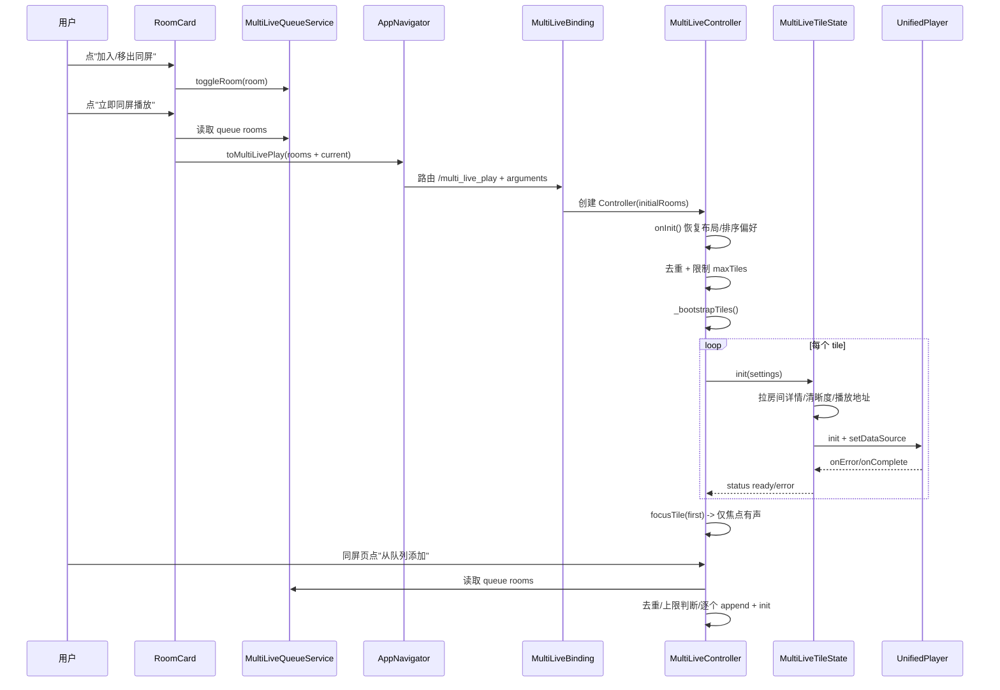
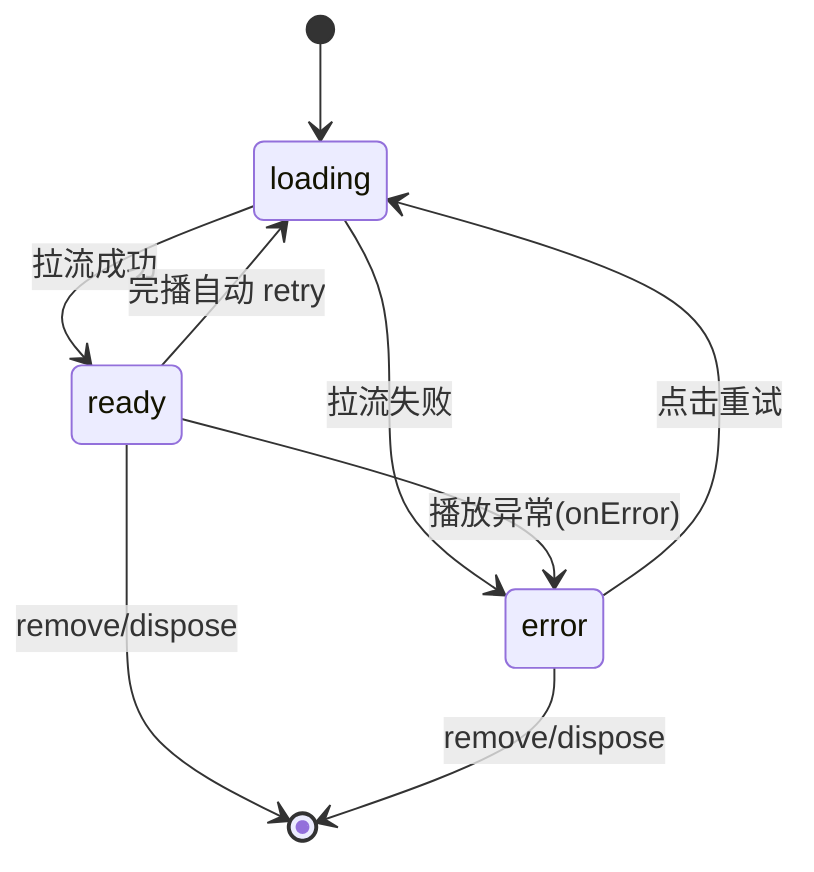

# 多屏逻辑说明与自适应布局方案

本文档详细说明当前"单窗口多屏同播"逻辑，并提供完整的自适应布局优化方案。

---

## 第一部分：当前实现分析

### 1. 一句话总览

- 入口分两类：
  - 队列入口：房间卡加入/移出同屏队列。
  - 直达入口：房间卡"立即同屏播放"，会把当前房间与队列合并后跳转同屏页。
- 同屏页支持两种继续加房间方式：
  - 从同屏队列批量添加。
  - 从收藏/历史单个添加。
- 每个 tile 独立播放器实例，焦点 tile 默认有声，其余静音。

### 2. 端到端时序



### 3. 模块职责切分

| 模块 | 职责 |
|-----|------|
| RoomCard | 入口动作（队列开关、直达同屏） |
| MultiLiveQueueService | 同屏候选房间队列状态（增删查切换） |
| AppNavigator + Get 路由 | 参数传递与页面跳转 |
| MultiLiveController | 同屏业务编排中心（初始化、增删改、焦点音频、重排、持久化） |
| MultiLiveTileState | 单 tile 播放生命周期（拉流、异常、重试、播放器销毁） |

### 4. 当前关键规则

- 房间唯一键：`platform + roomId`。
- 最大同屏数：桌面 9，移动 4。
- 焦点音频规则：
  - `focusTile(tileId)` 后，目标 tile 取消静音，其余静音。
- 添加规则：
  - 已存在则跳过（或提示）。
  - 超上限则阻止并提示。
- 退出规则：
  - 全部 tile 被移除时自动退出同屏页。

### 5. 状态流转（tile 级）



### 6. 当前实现的问题

| 问题类型 | 具体问题 | 影响 |
|---------|---------|------|
| 布局限制 | 主副布局仅支持3/4屏 | 5-9屏无法使用主副布局 |
| 网格硬编码 | `options = [1,2,4,6,9]` 固定 | 无法动态扩展窗口数量 |
| 串行初始化 | `_bootstrapTiles()` 逐个await | 首屏加载慢 |
| 队列消费 | 添加后不清空 | 用户需手动管理 |

---

## 第二部分：自适应布局系统设计

### 1. 布局模式定义

```
┌─────────────────────────────────────────────────────────────────────────┐
│                           三种布局模式                                   │
├─────────────────────────────────────────────────────────────────────────┤
│                                                                         │
│  模式A: 等分布局 (equal)                                                 │
│  ┌───┬───┬───┐                                                         │
│  │ 1 │ 2 │ 3 │   所有tile大小相等，按网格均匀分布                         │
│  ├───┼───┼───┤                                                         │
│  │ 4 │ 5 │ 6 │   适用场景: 同时关注多个直播间，无主次之分                 │
│  └───┴───┴───┘                                                         │
│                                                                         │
│  模式B: 1主多副布局 (one_main)                                           │
│  ┌─────────────┬───┬───┐                                               │
│  │             │ 2 │ 3 │   1个大屏(主) + 多个小屏(副)                     │
│  │      1      ├───┼───┤                                               │
│  │    (主)     │ 4 │ 5 │   主屏面积约为副屏的2倍                          │
│  │             │   │   │   适用场景: 重点观看1个直播，其他辅助关注         │
│  └─────────────┴───┴───┘                                               │
│                                                                         │
│  模式C: 2主多副布局 (two_main)                                           │
│  ┌─────────────┬─────────────┐                                         │
│  │             │             │                                         │
│  │      1      │      2      │   2个大屏(主) + 多个小屏(副)               │
│  │    (主)     │    (主)     │                                         │
│  ├───────┬─────┼───────┬─────┤   主屏面积约为副屏的2倍                    │
│  │   3   │  4  │   5   │  6  │   适用场景: 同时重点观看2个直播            │
│  └───────┴─────┴───────┴─────┘                                         │
│                                                                         │
└─────────────────────────────────────────────────────────────────────────┘
```

### 2. 完整布局模板矩阵

#### 2.1 等分布局模板 (equal)

| 屏幕数 | 行数 | 列数 | 布局示意 |
|-------|-----|-----|---------|
| 1 | 1 | 1 | `[1]` |
| 2 | 1 | 2 | `[1][2]` |
| 3 | 1 | 3 | `[1][2][3]` |
| 4 | 2 | 2 | `[1][2] / [3][4]` |
| 5 | 2 | 3 | `[1][2][3] / [4][5][ ]` |
| 6 | 2 | 3 | `[1][2][3] / [4][5][6]` |
| 7 | 3 | 3 | `[1][2][3] / [4][5][6] / [7][ ][ ]` |
| 8 | 3 | 3 | `[1][2][3] / [4][5][6] / [7][8][ ]` |
| 9 | 3 | 3 | `[1][2][3] / [4][5][6] / [7][8][9]` |
| 10 | 4 | 3 | `[1][2][3] / [4][5][6] / [7][8][9] / [10][ ][ ]` |
| 12 | 4 | 3 | `[1][2][3] / [4][5][6] / [7][8][9] / [10][11][12]` |
| 16 | 4 | 4 | 4x4 网格 |

#### 2.2 1主多副布局模板 (one_main)

| 屏幕数 | 主屏数 | 副屏数 | 副屏布局 | 示意图 |
|-------|-------|-------|---------|--------|
| 2 | 1 | 1 | 1列 | `[主][副]` |
| 3 | 1 | 2 | 2列1行 | `[主][副1][副2]` |
| 4 | 1 | 3 | 3列1行 | `[主][副1][副2][副3]` |
| 5 | 1 | 4 | 2列2行 | `[主][副1][副2] / [副3][副4]` |
| 6 | 1 | 5 | 3列2行 | `[主][副1-3] / [副4-5]` |
| 7 | 1 | 6 | 3列2行 | `[主][副1-3] / [副4-6]` |
| 8 | 1 | 7 | 3列3行 | `[主][副1-3] / [副4-6] / [副7]` |
| 9 | 1 | 8 | 4列2行 | `[主][副1-4] / [副5-8]` |

**详细布局图示：**

```
2屏 (1主+1副):              3屏 (1主+2副):
┌─────────────┬───────────┐ ┌─────────────┬─────┬─────┐
│             │           │ │             │     │     │
│     主      │    副     │ │     主      │ 副1 │ 副2 │
│             │           │ │             │     │     │
└─────────────┴───────────┘ └─────────────┴─────┴─────┘

4屏 (1主+3副):              5屏 (1主+4副):
┌─────────────┬─────┬─────┐ ┌─────────────┬─────┬─────┐
│             │     │     │ │             │ 副1 │ 副2 │
│     主      │ 副1 │ 副2 │ │     主      ├─────┼─────┤
│             │     │     │ │             │ 副3 │ 副4 │
├─────────────┼─────┴─────┤ └─────────────┴─────┴─────┘
│             │    副3    │
│    空       │           │
└─────────────┴───────────┘

6屏 (1主+5副):              7屏 (1主+6副):
┌─────────────┬─────┬─────┐ ┌─────────────┬─────┬─────┐
│             │ 副1 │ 副2 │ │             │ 副1 │ 副2 │
│     主      ├─────┼─────┤ │     主      ├─────┼─────┤
│             │ 副3 │ 副4 │ │             │ 副3 │ 副4 │
├─────────────┼─────┴─────┤ ├─────────────┼─────┼─────┤
│    空       │ 副5 │     │ │    空       │ 副5 │ 副6 │
└─────────────┴───────────┘ └─────────────┴─────┴─────┘

9屏 (1主+8副):
┌─────────────┬─────┬─────┬─────┐
│             │ 副1 │ 副2 │ 副3 │
│     主      ├─────┼─────┼─────┤
│             │ 副4 │ 副5 │ 副6 │
├─────────────┼─────┼─────┼─────┤
│    空       │ 副7 │ 副8 │     │
└─────────────┴─────┴─────┴─────┘
```

#### 2.3 2主多副布局模板 (two_main)

| 屏幕数 | 主屏数 | 副屏数 | 副屏布局 | 示意图 |
|-------|-------|-------|---------|--------|
| 2 | 2 | 0 | 无副屏 | `[主1][主2]` |
| 3 | 2 | 1 | 1列 | `[主1][主2] / [副]` |
| 4 | 2 | 2 | 2列1行 | `[主1][主2] / [副1][副2]` |
| 5 | 2 | 3 | 3列1行 | `[主1][主2] / [副1][副2][副3]` |
| 6 | 2 | 4 | 2列2行 | `[主1][主2] / [副1-2] / [副3-4]` |
| 7 | 2 | 5 | 3列2行 | `[主1][主2] / [副1-3] / [副4-5]` |
| 8 | 2 | 6 | 3列2行 | `[主1][主2] / [副1-3] / [副4-6]` |
| 9 | 2 | 7 | 4列2行 | `[主1][主2] / [副1-4] / [副5-7]` |

**详细布局图示：**

```
2屏 (2主):                  3屏 (2主+1副):
┌─────────────┬─────────────┐ ┌─────────────┬─────────────┐
│             │             │ │             │             │
│    主1      │    主2      │ │    主1      │    主2      │
│             │             │ │             │             │
└─────────────┴─────────────┘ ├─────────────┴─────────────┤
                              │            副             │
                              └───────────────────────────┘

4屏 (2主+2副):              5屏 (2主+3副):
┌─────────────┬─────────────┐ ┌─────────────┬─────────────┐
│             │             │ │             │             │
│    主1      │    主2      │ │    主1      │    主2      │
│             │             │ │             │             │
├───────┬─────┼───────┬─────┤ ├───────┬─────┼───────┬─────┤
│  副1  │ 副2 │  副3  │ 副4 │ │  副1  │ 副2 │  副3  │     │
└───────┴─────┴───────┴─────┘ └───────┴─────┴───────┴─────┘

6屏 (2主+4副):              8屏 (2主+6副):
┌─────────────┬─────────────┐ ┌─────────────┬─────────────┐
│             │             │ │             │             │
│    主1      │    主2      │ │    主1      │    主2      │
│             │             │ │             │             │
├─────┬───────┼─────┬───────┤ ├─────┬───┬───┼─────┬───┬───┤
│ 副1 │  副2  │ 副3 │  副4  │ │ 副1 │副2│副3│ 副4 │副5│副6│
├─────┼───────┼─────┼───────┤ └─────┴───┴───┴─────┴───┴───┘
│ 副5 │  副6  │     │       │
└─────┴───────┴─────┴───────┘
```

### 3. 自适应布局算法

```dart
/// 布局模式枚举
enum MultiLiveLayoutMode {
  equal,    // 等分布局
  oneMain,  // 1主多副
  twoMain,  // 2主多副
}

/// 布局配置
class MultiLiveLayoutConfig {
  final int totalTiles;
  final MultiLiveLayoutMode mode;
  final int mainCount;      // 主屏数量
  final int subCount;       // 副屏数量
  final int subColumns;     // 副屏列数
  final int subRows;        // 副屏行数
  final double mainRatio;   // 主屏占比 (0-1)
  
  const MultiLiveLayoutConfig({
    required this.totalTiles,
    required this.mode,
    required this.mainCount,
    required this.subCount,
    required this.subColumns,
    required this.subRows,
    required this.mainRatio,
  });
}

/// 自适应布局计算器
class MultiLiveLayoutCalculator {
  
  /// 根据屏幕数量和模式计算布局配置
  static MultiLiveLayoutConfig calculate(int tileCount, MultiLiveLayoutMode mode) {
    switch (mode) {
      case MultiLiveLayoutMode.equal:
        return _calculateEqual(tileCount);
      case MultiLiveLayoutMode.oneMain:
        return _calculateOneMain(tileCount);
      case MultiLiveLayoutMode.twoMain:
        return _calculateTwoMain(tileCount);
    }
  }
  
  /// 等分布局计算
  static MultiLiveLayoutConfig _calculateEqual(int n) {
    int columns;
    int rows;
    
    if (n <= 1) {
      columns = 1;
      rows = 1;
    } else if (n == 2) {
      columns = 2;
      rows = 1;
    } else if (n <= 4) {
      columns = 2;
      rows = 2;
    } else if (n <= 6) {
      columns = 3;
      rows = 2;
    } else if (n <= 9) {
      columns = 3;
      rows = 3;
    } else if (n <= 12) {
      columns = 3;
      rows = 4;
    } else {
      columns = 4;
      rows = (n / 4).ceil();
    }
    
    return MultiLiveLayoutConfig(
      totalTiles: n,
      mode: MultiLiveLayoutMode.equal,
      mainCount: 0,
      subCount: n,
      subColumns: columns,
      subRows: rows,
      mainRatio: 0,
    );
  }
  
  /// 1主多副布局计算
  static MultiLiveLayoutConfig _calculateOneMain(int n) {
    if (n < 2) {
      return _calculateEqual(n);
    }
    
    final subCount = n - 1;
    int subColumns;
    int subRows;
    
    if (subCount <= 3) {
      subColumns = subCount;
      subRows = 1;
    } else if (subCount <= 6) {
      subColumns = 3;
      subRows = 2;
    } else {
      subColumns = 4;
      subRows = 2;
    }
    
    return MultiLiveLayoutConfig(
      totalTiles: n,
      mode: MultiLiveLayoutMode.oneMain,
      mainCount: 1,
      subCount: subCount,
      subColumns: subColumns,
      subRows: subRows,
      mainRatio: 0.5,  // 主屏占50%宽度
    );
  }
  
  /// 2主多副布局计算
  static MultiLiveLayoutConfig _calculateTwoMain(int n) {
    if (n < 2) {
      return _calculateEqual(n);
    }
    if (n == 2) {
      return MultiLiveLayoutConfig(
        totalTiles: 2,
        mode: MultiLiveLayoutMode.twoMain,
        mainCount: 2,
        subCount: 0,
        subColumns: 0,
        subRows: 0,
        mainRatio: 1.0,
      );
    }
    
    final subCount = n - 2;
    int subColumns;
    int subRows;
    
    if (subCount <= 2) {
      subColumns = 2;
      subRows = 1;
    } else if (subCount <= 4) {
      subColumns = 2;
      subRows = 2;
    } else if (subCount <= 6) {
      subColumns = 3;
      subRows = 2;
    } else {
      subColumns = 4;
      subRows = 2;
    }
    
    return MultiLiveLayoutConfig(
      totalTiles: n,
      mode: MultiLiveLayoutMode.twoMain,
      mainCount: 2,
      subCount: subCount,
      subColumns: subColumns,
      subRows: subRows,
      mainRatio: 0.5,  // 主屏区占50%宽度
    );
  }
}
```

### 4. 动态窗口数量控制

```dart
/// 窗口数量管理器
class MultiLiveWindowConfig {
  /// 默认最大窗口数
  static int get defaultMaxTiles => PlatformUtils.isDesktop ? 9 : 4;
  
  /// 支持的最大窗口数上限
  static const int absoluteMax = 16;
  
  /// 支持的最小窗口数
  static const int absoluteMin = 1;
  
  /// 用户自定义最大窗口数
  static int? _customMaxTiles;
  
  /// 获取当前最大窗口数
  static int get maxTiles => _customMaxTiles ?? defaultMaxTiles;
  
  /// 设置自定义最大窗口数
  static void setCustomMaxTiles(int value) {
    if (value >= absoluteMin && value <= absoluteMax) {
      _customMaxTiles = value;
      HivePrefUtil.setInt('multi_live_custom_max_tiles', value);
    }
  }
  
  /// 获取推荐的网格选项
  static List<int> getGridOptions(int currentMax) {
    return [1, 2, 3, 4, 5, 6, 7, 8, 9, 10, 12, 16]
        .where((n) => n <= currentMax)
        .toList();
  }
}
```

### 5. 布局切换UI设计

```
┌─────────────────────────────────────────────────────────────────────────┐
│                          布局切换控制面板                                 │
├─────────────────────────────────────────────────────────────────────────┤
│                                                                         │
│  ┌─────────────────────────────────────────────────────────────────┐   │
│  │  布局模式                                                        │   │
│  │  ┌─────────┐  ┌─────────┐  ┌─────────┐                         │   │
│  │  │ ▦▦▦▦  │  │ ▢▦▦   │  │ ▢▢     │                         │   │
│  │  │ ▦▦▦▦  │  │ ▦▦▦   │  │ ▦▦▦   │                         │   │
│  │  │         │  │         │  │         │                         │   │
│  │  │  等分   │  │ 1主多副 │  │ 2主多副 │                         │   │
│  │  └─────────┘  └─────────┘  └─────────┘                         │   │
│  └─────────────────────────────────────────────────────────────────┘   │
│                                                                         │
│  ┌─────────────────────────────────────────────────────────────────┐   │
│  │  窗口数量: [1] [2] [3] [4] [5] [6] [7] [8] [9] [更多▼]          │   │
│  └─────────────────────────────────────────────────────────────────┘   │
│                                                                         │
│  ┌─────────────────────────────────────────────────────────────────┐   │
│  │  主屏设置 (仅主副模式)                                           │   │
│  │  ┌──────────────────────────────────────────────────────────┐   │   │
│  │  │ 主屏比例: ●─────────○  50%                                │   │   │
│  │  │ (可拖动调整主屏占比: 30% ~ 70%)                            │   │   │
│  │  └──────────────────────────────────────────────────────────┘   │   │
│  └─────────────────────────────────────────────────────────────────┘   │
│                                                                         │
└─────────────────────────────────────────────────────────────────────────┘
```

---

## 第三部分：优化实施计划

### P0 级优化（必须实施）

#### 1. 并发初始化 + 首屏优先

**现状问题：** `_bootstrapTiles()` 串行初始化，9屏需等待所有初始化完成

**优化方案：**

```dart
/// 优化后的初始化流程
Future<void> _bootstrapTilesOptimized() async {
  if (tiles.isEmpty) return;
  
  // 阶段1: 首屏优先初始化
  await tiles.first.init(settings);
  await focusTile(tiles.first.tileId);
  
  // 阶段2: 批量并发初始化剩余tile (并发数=2)
  final remaining = tiles.skip(1).toList();
  const concurrency = 2;
  
  for (var i = 0; i < remaining.length; i += concurrency) {
    final batch = remaining.skip(i).take(concurrency);
    await Future.wait(batch.map((tile) => tile.init(settings)));
  }
}
```

**预期效果：** 首屏加载时间减少70%

#### 2. 自适应布局系统

**现状问题：** 主副布局仅支持3/4屏，网格选项硬编码

**优化方案：** 实现上述 `MultiLiveLayoutCalculator` 和 `MultiLiveLayoutConfig`

#### 3. 队列消费策略配置化

**现状问题：** 从队列添加后不自动清空

**优化方案：**

```dart
enum QueueConsumeMode {
  keep,         // 保持队列不变
  removeAdded,  // 仅移除已成功添加的项
  clearAll,     // 添加后清空队列
}

// SettingsService 新增配置
final multiLiveQueueConsumeMode = 
    (HivePrefUtil.getString('multiLiveQueueConsumeMode') ?? 'keep').obs;
```

### P1 级优化（体验提升）

#### 1. 编辑模式拖拽

**现状问题：** 长按拖拽易误触

**优化方案：** 增加"编辑模式"按钮，进入后可直接拖拽

#### 2. Tile初始化超时保护

**优化方案：**

```dart
Future<void> init(SettingsService settings) async {
  status.value = MultiLiveTileStatus.loading;
  
  try {
    await initInternal(settings)
        .timeout(const Duration(seconds: 15));
    status.value = MultiLiveTileStatus.ready;
  } on TimeoutException {
    status.value = MultiLiveTileStatus.error;
    errorMessage.value = '初始化超时';
  } catch (e) {
    status.value = MultiLiveTileStatus.error;
    errorMessage.value = e.toString();
  }
}
```

#### 3. 错误分类细化

```dart
enum TileErrorType {
  network,      // 网络错误
  auth,         // 认证失败
  sourceParse,  // 播放源解析失败
  timeout,      // 超时
  unknown,      // 未知错误
}

class MultiLiveTileState {
  TileErrorType? errorType;
  
  void _classifyError(dynamic error) {
    final msg = error.toString().toLowerCase();
    if (msg.contains('timeout') || msg.contains('超时')) {
      errorType = TileErrorType.timeout;
    } else if (msg.contains('auth') || msg.contains('login')) {
      errorType = TileErrorType.auth;
    } else if (msg.contains('network') || msg.contains('socket')) {
      errorType = TileErrorType.network;
    } else {
      errorType = TileErrorType.unknown;
    }
  }
}
```

### P2 级优化（稳定性）

#### 1. 统一添加管线

```dart
/// 统一的房间添加方法
Future<AddRoomsResult> appendRooms(List<LiveRoom> rooms) async {
  final result = AddRoomsResult();
  
  for (final room in rooms) {
    if (containsRoom(room)) {
      result.duplicated.add(room);
      continue;
    }
    if (tiles.length >= maxTiles) {
      result.blockedByLimit.add(room);
      continue;
    }
    
    final tile = MultiLiveTileState(room: room);
    tiles.add(tile);
    await _initNewTile(tile);
    result.added.add(room);
  }
  
  if (result.added.isNotEmpty) {
    _syncGridCountWithTiles();
    await _persistTileOrder();
  }
  
  return result;
}

class AddRoomsResult {
  final List<LiveRoom> added = [];
  final List<LiveRoom> duplicated = [];
  final List<LiveRoom> blockedByLimit = [];
}
```

---

## 第四部分：实施顺序建议

| 阶段 | 优化项 | 优先级 | 预计工作量 |
|-----|-------|-------|-----------|
| 第1阶段 | 并发初始化 + 首屏优先 | P0 | 中 |
| 第2阶段 | 自适应布局系统（等分/1主/2主） | P0 | 高 |
| 第3阶段 | 队列消费策略配置化 | P0 | 低 |
| 第4阶段 | 编辑模式拖拽 | P1 | 中 |
| 第5阶段 | 超时保护 + 错误分类 | P1 | 低 |
| 第6阶段 | 统一添加管线 | P2 | 中 |

---

## 第五部分：按钮位置优化方案

### 1. 当前按钮布局分析

#### 1.1 RoomCard 房间卡片（入口）

**当前布局：**
```
┌────────────────────────────────────────┐
│ ┌──┐                                   │
│ │+ │ ← 加入/移出同屏队列                │
│ └──┘                                   │
│ ┌──┐                                   │
│ │▶ │ ← 立即同屏播放                     │
│ └──┘                                   │
│                        ┌──────────┐    │
│                        │ 🔴 回放  │    │
│                        └──────────┘    │
│          直播封面图片                   │
│                                        │
│                        ┌──────────┐    │
│                        │🔥 1.2万  │    │
│                        └──────────┘    │
└────────────────────────────────────────┘
```

**问题分析：**
| 问题 | 描述 | 影响 |
|-----|------|------|
| 垂直排列 | 两个按钮上下排列 | 占用左侧空间，遮挡封面 |
| 图标含义不清 | `add_box_outlined` 和 `play_circle` 不够直观 | 用户可能不理解功能 |
| 无状态区分 | 加入队列后仅改变图标 | 视觉反馈不够明显 |
| 操作冗余 | 长按弹窗也有相同功能 | 入口重复 |

#### 1.2 MultiLivePage 同屏页面

**当前布局：**
```
┌────────────────────────────────────────────────────────────┐
│ ← 同屏播放 (4)                    [📋] [+] [⋮布局]        │
├────────────────────────────────────────────────────────────┤
│                                                            │
│                     同屏内容区域                            │
│                                                            │
└────────────────────────────────────────────────────────────┘

AppBar按钮说明：
[📋] = 从同屏队列添加（带Badge显示数量）
[+]  = 添加直播间（从收藏/历史）
[⋮]  = 布局模式选择（等分/主副）
```

**问题分析：**
| 问题 | 描述 | 影响 |
|-----|------|------|
| 布局选项少 | 仅支持等分/主副两种 | 无法选择1主/2主模式 |
| 功能分散 | 添加入口分散在多处 | 操作不便 |
| 无快捷操作 | 缺少全屏静音、全部刷新等 | 批量操作效率低 |

#### 1.3 Tile内按钮

**当前布局：**
```
┌──────────────────────────────────────────────────────┐
│ 主播名称                    [🔊] [🔄] [✕]           │
├──────────────────────────────────────────────────────┤
│                                                      │
│                    视频播放区域                        │
│                                                      │
└──────────────────────────────────────────────────────┘

按钮说明：
[🔊] = 静音切换
[🔄] = 刷新
[✕]  = 移除
```

**问题分析：**
| 问题 | 描述 | 影响 |
|-----|------|------|
| 按钮过多 | 顶部栏4个元素 | 占用播放空间 |
| 无展开/收起 | 按钮始终显示 | 影响观看体验 |
| 缺少清晰度切换 | 无法切换画质 | 功能不完整 |

---

### 2. 优化方案设计

#### 2.1 RoomCard 按钮优化

**方案A：合并为下拉菜单（推荐）**
```
┌────────────────────────────────────────┐
│ ┌────┐                                │
│ │ ⋮  │ ← 点击展开菜单                  │
│ └────┘                                │
│         ┌──────────────────┐          │
│         │ ✓ 已在队列       │          │
│         │ ▶ 立即同屏播放    │          │
│         │ ─────────────── │          │
│         │ ♡ 关注          │          │
│         └──────────────────┘          │
│                        ┌──────────┐    │
│                        │ 🔴 回放  │    │
│                        └──────────┘    │
│          直播封面图片                   │
└────────────────────────────────────────┘

优点：
- 节省空间，不遮挡封面
- 功能集中，逻辑清晰
- 可扩展更多选项
```

**方案B：底部悬浮按钮**
```
┌────────────────────────────────────────┐
│                                        │
│                        ┌──────────┐    │
│                        │ 🔴 回放  │    │
│                        └──────────┘    │
│          直播封面图片                   │
│                                        │
│                        ┌──────────┐    │
│                        │🔥 1.2万  │    │
│                        └──────────┘    │
├────────────────────────────────────────┤
│ ┌────────────────────────────────────┐ │
│ │  [+ 队列]  [▶ 同屏]  [♡ 关注]     │ │
│ └────────────────────────────────────┘ │
└────────────────────────────────────────┘

优点：
- 不遮挡封面任何区域
- 按钮更大，更易点击
- 状态更明显
```

**方案C：右下角浮动按钮组**
```
┌────────────────────────────────────────┐
│                        ┌──────────┐    │
│                        │ 🔴 回放  │    │
│                        └──────────┘    │
│          直播封面图片                   │
│                        ┌──────────┐    │
│                        │🔥 1.2万  │    │
│                        └──────────┐──┐ │
│                        │ [+][▶]   │♡ │ │
│                        └──────────┴──┘ │
└────────────────────────────────────────┘

优点：
- 利用右下角空白区域
- 按钮紧凑但不重叠
- 与热度标签对齐
```

**推荐方案：方案B（底部悬浮按钮）**

#### 2.2 MultiLivePage AppBar 优化

**优化后的布局：**
```
┌────────────────────────────────────────────────────────────────────┐
│ ← 同屏播放 (4)                                              [⋮]   │
├────────────────────────────────────────────────────────────────────┤
│ ┌────────────────────────────────────────────────────────────────┐ │
│ │  [+ 添加] [📋 队列(3)] [🔇 全静音] [🔄 全刷新] [📊 布局]       │ │
│ └────────────────────────────────────────────────────────────────┘ │
├────────────────────────────────────────────────────────────────────┤
│                                                                    │
│                         同屏内容区域                                │
│                                                                    │
└────────────────────────────────────────────────────────────────────┘

底部工具栏按钮说明：
[+ 添加]     = 添加直播间（合并收藏/历史/队列入口）
[📋 队列(3)] = 从队列添加，显示队列数量
[🔇 全静音]  = 一键静音所有tile
[🔄 全刷新]  = 一键刷新所有tile
[📊 布局]    = 布局模式选择（等分/1主/2主）
[⋮]         = 更多选项（设置、帮助等）
```

**布局选择弹窗优化：**
```
┌──────────────────────────────────────────────────┐
│  选择布局模式                                      │
├──────────────────────────────────────────────────┤
│                                                  │
│  ┌─────────┐  ┌─────────┐  ┌─────────┐         │
│  │ ┌─┬─┬─┐ │  │ ┌───┬─┐ │  │ ┌───┬───┐ │         │
│  │ ├─┼─┼─┤ │  │ │   ├─┤ │  │ │   │   │ │         │
│  │ └─┴─┴─┘ │  │ └───┴─┘ │  │ ├───┼─┬─┤ │         │
│  │         │  │         │  │ │   │ │ │ │         │
│  │  等分   │  │ 1主多副 │  │ 2主多副 │         │
│  │  (当前) │  │         │  │         │         │
│  └─────────┘  └─────────┘  └─────────┘         │
│                                                  │
│  ─────────────────────────────────────────────  │
│                                                  │
│  窗口数量:  [1] [2] [3] [4] [5] [6] [7] [8] [9] │
│                                                  │
│  主屏比例:  ○─────────●──────○  50%             │
│             (可调整: 30% - 70%)                  │
│                                                  │
│                              [取消]  [确定]      │
└──────────────────────────────────────────────────┘
```

#### 2.3 Tile内按钮优化

**方案：可展开/收起的控制栏**

**默认状态（收起）：**
```
┌──────────────────────────────────────────────────────┐
│ 主播名称                                    [⋮]     │
├──────────────────────────────────────────────────────┤
│                                                      │
│                    视频播放区域                        │
│                                                      │
│                                                      │
└──────────────────────────────────────────────────────┘
```

**展开状态：**
```
┌──────────────────────────────────────────────────────┐
│ 主播名称                        [🔊] [🔄] [✕] [▼]  │
├──────────────────────────────────────────────────────┤
│ ┌──────────────────────────────────────────────────┐ │
│ │ 清晰度: [原画 ▼]  线路: [线路1 ▼]               │ │
│ └──────────────────────────────────────────────────┘ │
├──────────────────────────────────────────────────────┤
│                                                      │
│                    视频播放区域                        │
│                                                      │
└──────────────────────────────────────────────────────┘

按钮说明：
[🔊] = 静音切换
[🔄] = 刷新
[✕]  = 移除
[▼]  = 收起控制栏
```

**Hover/点击显示（桌面端优化）：**
```
┌──────────────────────────────────────────────────────┐
│                                                      │
│                    视频播放区域                        │
│                                                      │
│                                                      │
│              ┌─────────────────────────┐             │
│              │ [🔊] [🔄] [⚙] [✕]      │ ← 悬浮显示  │
│              └─────────────────────────┘             │
└──────────────────────────────────────────────────────┘

桌面端：鼠标悬停时显示控制栏
移动端：点击tile时显示控制栏，3秒后自动隐藏
```

---

### 3. 完整按钮布局规范

#### 3.1 入口层（RoomCard）

```
┌─────────────────────────────────────────────────────────────────┐
│                        RoomCard 优化布局                         │
├─────────────────────────────────────────────────────────────────┤
│                                                                 │
│  ┌─────────────────────────────────────────────────────────┐   │
│  │                                                         │   │
│  │                    直播封面图片                          │   │
│  │                                                         │   │
│  │  ┌──────────┐                          ┌──────────┐     │   │
│  │  │ 🔴 回放  │                          │🔥 1.2万  │     │   │
│  │  └──────────┘                          └──────────┘     │   │
│  │                                                         │   │
│  └─────────────────────────────────────────────────────────┘   │
│  ┌─────────────────────────────────────────────────────────┐   │
│  │  [+ 队列]  [▶ 同屏]  [♡ 关注]          平台 · 主播名   │   │
│  └─────────────────────────────────────────────────────────┘   │
│  ┌─────────────────────────────────────────────────────────┐   │
│  │  📺 直播间标题                                          │   │
│  └─────────────────────────────────────────────────────────┘   │
│                                                                 │
└─────────────────────────────────────────────────────────────────┘

按钮功能：
┌──────────┬────────────────────────────────────────┐
│ 按钮     │ 功能说明                               │
├──────────┼────────────────────────────────────────┤
│ [+ 队列] │ 加入/移出同屏队列，已加入显示 [✓ 队列] │
│ [▶ 同屏] │ 立即同屏播放（当前房间+队列）           │
│ [♡ 关注] │ 收藏/取消收藏                          │
└──────────┴────────────────────────────────────────┘
```

#### 3.2 同屏页面层（MultiLivePage）

```
┌─────────────────────────────────────────────────────────────────┐
│                        同屏页面布局                              │
├─────────────────────────────────────────────────────────────────┤
│                                                                 │
│  ┌───────────────────────────────────────────────────────────┐ │
│  │  ← 同屏播放 (4)                                    [⋮]    │ │
│  └───────────────────────────────────────────────────────────┘ │
│  ┌───────────────────────────────────────────────────────────┐ │
│  │  [+ 添加] [📋 队列(3)] [🔇 全静音] [🔄 全刷新] [📊 布局]  │ │
│  └───────────────────────────────────────────────────────────┘ │
│  ┌───────────────────────────────────────────────────────────┐ │
│  │                                                           │ │
│  │                                                           │ │
│  │                      同屏播放区域                          │ │
│  │                                                           │ │
│  │                                                           │ │
│  └───────────────────────────────────────────────────────────┘ │
│                                                                 │
└─────────────────────────────────────────────────────────────────┘

工具栏按钮功能：
┌─────────────┬──────────────────────────────────────────┐
│ 按钮        │ 功能说明                                 │
├─────────────┼──────────────────────────────────────────┤
│ [+ 添加]    │ 打开添加弹窗（收藏/历史/队列标签页）      │
│ [📋 队列]   │ 从队列批量添加，显示队列数量Badge         │
│ [🔇 全静音] │ 一键静音所有tile                         │
│ [🔄 全刷新] │ 一键刷新所有tile                         │
│ [📊 布局]   │ 打开布局选择弹窗                         │
│ [⋮]         │ 更多选项（设置、帮助、关于）              │
└─────────────┴──────────────────────────────────────────┘
```

#### 3.3 Tile层（单个播放窗口）

```
┌─────────────────────────────────────────────────────────────────┐
│                        Tile按钮布局                              │
├─────────────────────────────────────────────────────────────────┤
│                                                                 │
│  状态1: 默认（控制栏隐藏）                                       │
│  ┌───────────────────────────────────────────────────────────┐ │
│  │                                                           │ │
│  │                      视频播放区域                          │ │
│  │                                                           │ │
│  │                                                           │ │
│  │                    (点击或悬停显示控制栏)                  │ │
│  │                                                           │ │
│  └───────────────────────────────────────────────────────────┘ │
│                                                                 │
│  状态2: 控制栏显示                                               │
│  ┌───────────────────────────────────────────────────────────┐ │
│  │ 主播名称                              [🔊][🔄][⚙][✕]     │ │
│  ├───────────────────────────────────────────────────────────┤ │
│  │ 清晰度: [原画 ▼]                    线路: [线路1 ▼]      │ │
│  ├───────────────────────────────────────────────────────────┤ │
│  │                                                           │ │
│  │                      视频播放区域                          │ │
│  │                                                           │ │
│  └───────────────────────────────────────────────────────────┘ │
│                                                                 │
│  状态3: 错误状态                                                 │
│  ┌───────────────────────────────────────────────────────────┐ │
│  │                                                           │ │
│  │                                                           │ │
│  │              ❌ 播放失败                                   │ │
│  │              网络连接超时                                  │ │
│  │                                                           │ │
│  │                 [🔄 重试]                                 │ │
│  │                                                           │ │
│  └───────────────────────────────────────────────────────────┘ │
│                                                                 │
└─────────────────────────────────────────────────────────────────┘

Tile按钮功能：
┌─────────┬────────────────────────────────────────────┐
│ 按钮    │ 功能说明                                   │
├─────────┼────────────────────────────────────────────┤
│ [🔊]    │ 静音切换，当前tile有声时高亮显示           │
│ [🔄]    │ 刷新当前tile                               │
│ [⚙]     │ 展开/收起详细设置（清晰度、线路）          │
│ [✕]     │ 移除当前tile                               │
└─────────┴────────────────────────────────────────────┘
```

---

### 4. 按钮交互规范

#### 4.1 状态反馈

| 按钮 | 默认状态 | 激活状态 | 禁用状态 |
|-----|---------|---------|---------|
| 队列 | `[+ 队列]` 灰色图标 | `[✓ 队列]` 主题色图标 | 队列已满时禁用 |
| 同屏 | `[▶ 同屏]` 可点击 | 跳转后无变化 | 无房间时禁用 |
| 关注 | `[♡ 关注]` 空心图标 | `[♥ 已关注]` 实心红色 | - |
| 静音 | `[🔊]` 图标 | `[🔇]` 图标 + 灰色 | - |
| 布局 | 显示当前模式名 | 选中项高亮 | - |

#### 4.2 操作确认

| 操作 | 是否需要确认 | 说明 |
|-----|-------------|------|
| 加入队列 | 否 | Toast提示即可 |
| 移出队列 | 否 | Toast提示即可 |
| 立即同屏 | 否 | 直接跳转 |
| 移除tile | 否 | Toast提示，可撤销 |
| 全部刷新 | 是 | 弹窗确认 |
| 清空队列 | 是 | 弹窗确认 |

#### 4.3 快捷键支持（桌面端）

| 快捷键 | 功能 |
|-------|------|
| `1-9` | 切换焦点到对应tile |
| `M` | 切换当前焦点tile静音 |
| `R` | 刷新当前焦点tile |
| `Delete` | 移除当前焦点tile |
| `F` | 全屏当前焦点tile |
| `Esc` | 退出全屏/返回 |

---

### 5. 实施优先级

| 优先级 | 优化项 | 影响范围 | 工作量 |
|-------|-------|---------|-------|
| P0-1 | RoomCard底部按钮栏 | 入口体验 | 中 |
| P0-2 | MultiLivePage底部工具栏 | 操作效率 | 中 |
| P0-3 | 布局选择弹窗优化 | 功能完整性 | 高 |
| P1-1 | Tile控制栏自动隐藏 | 观看体验 | 中 |
| P1-2 | 清晰度/线路切换 | 功能完整性 | 高 |
| P2-1 | 桌面端快捷键 | 操作效率 | 低 |

---

## 附录：关键文件索引

| 文件 | 路径 | 主要职责 |
|-----|------|---------|
| MultiLiveController | `lib/modules/live_play/multi_live_controller.dart` | 同屏业务编排 |
| MultiLivePage | `lib/modules/live_play/multi_live_page.dart` | UI渲染与布局 |
| MultiLiveBinding | `lib/modules/live_play/multi_live_binding.dart` | 依赖注入 |
| MultiLiveQueueService | `lib/common/services/multi_live_queue_service.dart` | 队列管理 |
| RoomCard | `lib/common/widgets/room_card.dart` | 入口触发 |
| AppNavigator | `lib/routes/app_navigation.dart` | 路由跳转 |
| HivePrefUtil | `lib/common/utils/hive_pref_util.dart` | 持久化存储 |
